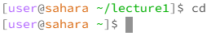
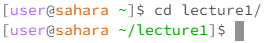
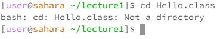
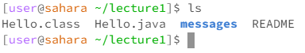
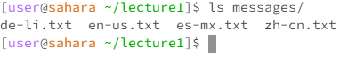
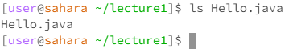
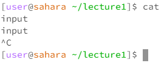
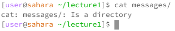
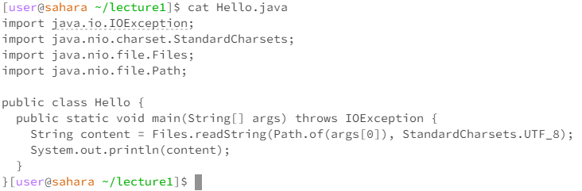

# Lab Report 1
## Remote Access and FileSystem
**`cd` no arguments:**

* Working Directory: `/home/lecture1`
* Running the command with no argument caused the working directory to go backwards out of the folder to `/home' 
* The output is not an error
A sentence or two explaining why you got that output (e.g. what was in the filesystem, what it meant to have no arguments).
Indicate whether the output is an error or not, and if it's an error, explain why it's an error.

**`cd` directory argument:**

* Working Directory: `/home`
* Running the command with a directory argument causes the working directory to update to the new directory given by the argument changing the working directory to `/home/lecture1`.
* The output is not an error

**`cd` file argument:**

* Working Directory: `/home/lecture1`
* The output returns `bashg: cd: Hello.class: Not a directory` because the command cd locates a new directory and Hello.class is a file not a directory.
* Throws an error because cd doesn't have the functionality to do anything with files, it is designed to locate new directories.

**`ls` no argument:**

* Working Directory: `/home/lecture1`
* Running the command returns a list of all the file names and folder names within the working directory `/home/lecture1`: Hello.class, Hello.java, **messages**, README.
* The output is not an error

**`ls` directory argument:**

* Working Directory: `/home/lecture1`
* Running the command gets all the file and folder names within the folder messages at the directory `/home/lecture1` and returns them as a list in the output: de-li.txt, en-us.txt, es-mx.txt, zh-cn.txt.
* The output is not an error

**`ls` file arguments:**

* Working Directory: `/home/lecture1`
* Running the command will retrieve the file name within the working directory and will output the filename which is also the same as the argument you put in.
* The output is not an error

**`cat` no arguments:**

* Working Directory: `/home/lecture1`
* Running the command with no arguments causes the terminal to default to outputting what you inputted. Needed to ctrl+C to get out and return to the normal command line.
* The output is not an error.

**`cat` directory argument:**

* Working Directory: `/home/lecture1`
* Running the command with a directory argument returns the output `cat: messages/: Is a directory` which means that the cat can't perform its intended purpose because the argument lead to a directory being the path.
* The output is an error as cat doesn't work with directories and the input paths to a directory.

**`cat` file arguments**

* Working Directory: `/home/lecture1`
* Running the command with a file argument returns the contents of the file. In this case, it returns all the imports and code of the Hello.java file and prints it to terminal.
* The output is not an error.
