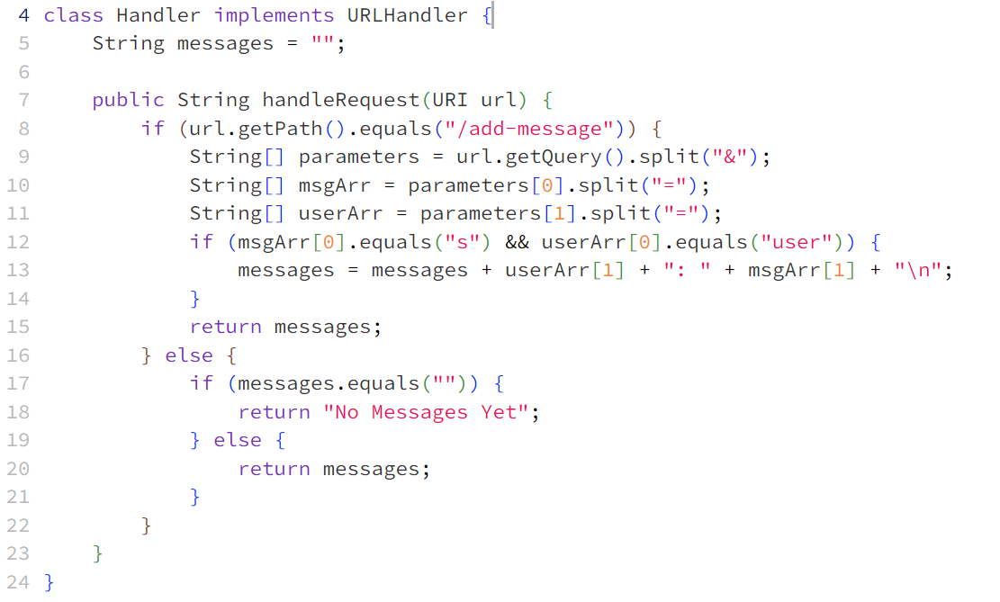
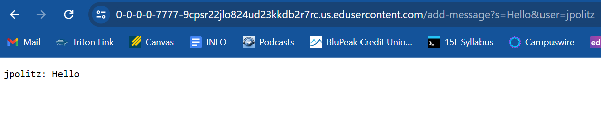
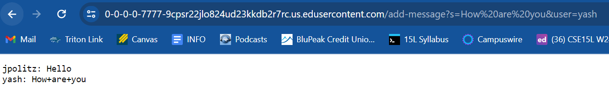
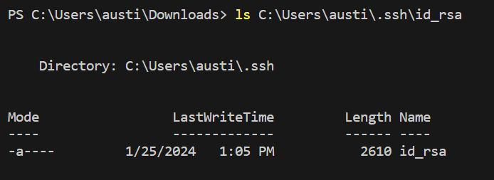
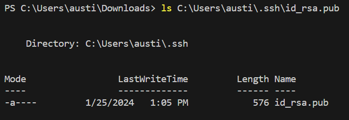
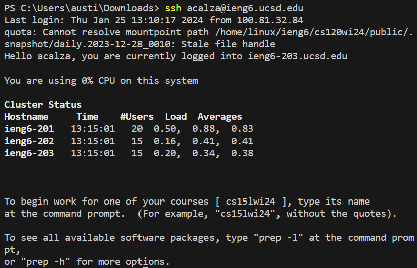

# Lab Report 2
## Servers and SSH Keys
**Part 1: Chat Server**

Here is the code from my chat server. The rest of the code is the exact same as in the `NumberServer.java` file. For the updated Handler class, it first initalizes a `String: messages` to the empty string which will store the history of chat messages. The method handleRequest, which is called by `Server.java`, will take the url as a method parameter and first checks if the url path begins with `/add-message`. If it does, it will begin to split it according to some rules which I will get into below and added the message to the `messages` string. If the path is wrong/no path, then it will return `No Messages Yet` or the chat history if it already exists.

In this image, you can see the url path of `/add-message?s=Hello&user=jpolitz`. Looking back to the code, let begin to see how this input is split. It begins by creating a String array called `parameters` and sets it equal to the url query, the part after the `?`, split and not including `&`. It looks like this as an array: `parameters: {"s=Hello", "user=jpolitz"}`. Once we have this array with the two parameters, we begin to split it again for each item in the array at its equals sign. It looks like this: `msgArr: {"s, Hello"}` and `userArr: {"user, jpolitz"}`. Now that we have the query split up properly, we use the if statement to check that the first value in the msgArr is equal to "s" and the first value in the userArr is equal to "user". If this passes, it adds it to the `messages` String by first of all copying the `messages` String and then adding the `user + ": " + msg + "\n"` and sets it equal to the messages array. The `"\n"` uses the backslash as an escape key with the n signaling the String to move down to the next line. The program returns this String to the Server and it prints the message on the screen.

Using the same url path keys with different messages will do the exact same process as above, and add it to the `messages` String. As you can see here, the url path `/add-messages?How are you=Hello&user=yash` adds the user and msg to the screen below the first one.

**Part 2: SSH Logins**
The absolute path to the private key:

The absolute path to the public key:

Terminal Interaction Logging into `ieng6` without password:

**Part 3: What I learned**
Something I learned in week 2 & 3 which I didn't know before is how to create a local webserver on my own computer using SSH and a port number. I also learned about the different parts of a url, what the mean, and how to use them within java in order implement different functions. I always knew what urls were and the different basic parts, but I never realized how to use them in my own applications.
